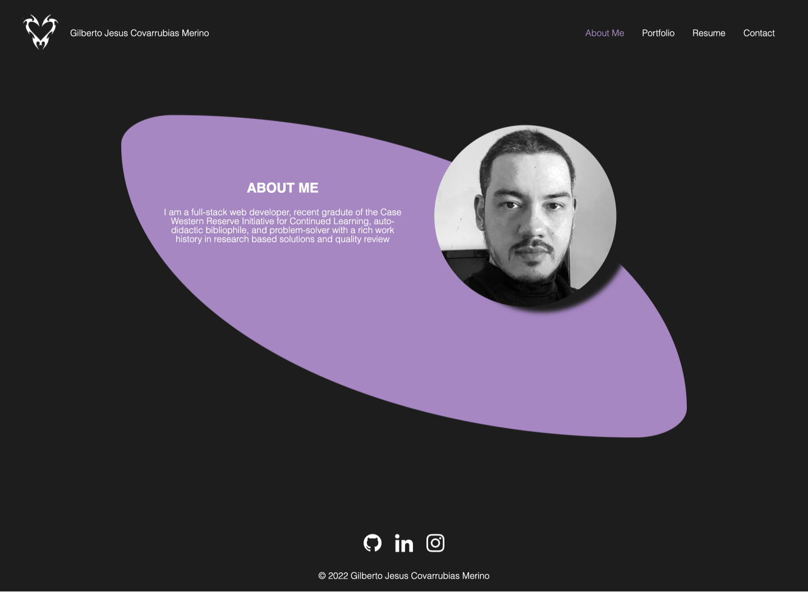

# Professional Portfolio

## Description
---
This is my professional React portfolio. This will be a resource for myself and potential employers. Employers can access my previous works and determine whether I am the proper fit for the position they are looking to fill.

## Features
---
Constructed with React. Includes multiple components that conditionally render, depending on which navigation link is selected. Contains links, both in the form of list items and images. The UI is interactive and navigation is intuative. Layout was also optimized for varying screen sizes through the use of flexboxes and media queries.  

## Usage
---
To use website go to link provided below. To experience functionality 

## Link to website/environment
---
[Portfolio]https://perfect-perfect.github.io/react-portfolio/)

## License
---
MIT License

Copyright (c) 2021 Gilberto Jesus Covarrubias Merino

Permission is hereby granted, free of charge, to any person obtaining a copy
of this software and associated documentation files (the "Software"), to deal
in the Software without restriction, including without limitation the rights
to use, copy, modify, merge, publish, distribute, sublicense, and/or sell
copies of the Software, and to permit persons to whom the Software is
furnished to do so, subject to the following conditions:

The above copyright notice and this permission notice shall be included in all
copies or substantial portions of the Software.

THE SOFTWARE IS PROVIDED "AS IS", WITHOUT WARRANTY OF ANY KIND, EXPRESS OR
IMPLIED, INCLUDING BUT NOT LIMITED TO THE WARRANTIES OF MERCHANTABILITY,
FITNESS FOR A PARTICULAR PURPOSE AND NONINFRINGEMENT. IN NO EVENT SHALL THE
AUTHORS OR COPYRIGHT HOLDERS BE LIABLE FOR ANY CLAIM, DAMAGES OR OTHER
LIABILITY, WHETHER IN AN ACTION OF CONTRACT, TORT OR OTHERWISE, ARISING FROM,
OUT OF OR IN CONNECTION WITH THE SOFTWARE OR THE USE OR OTHER DEALINGS IN THE
SOFTWARE.

